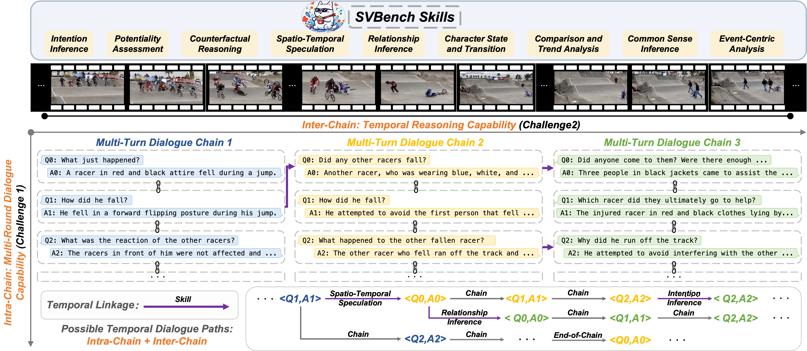
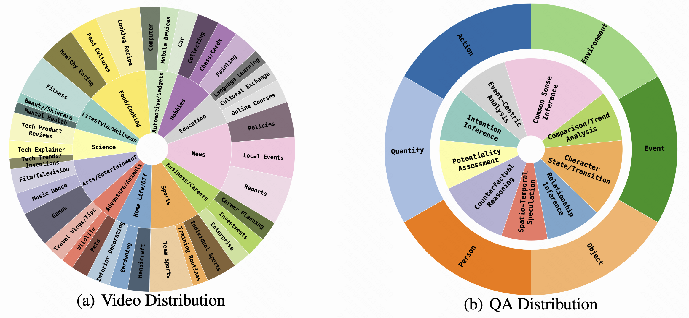
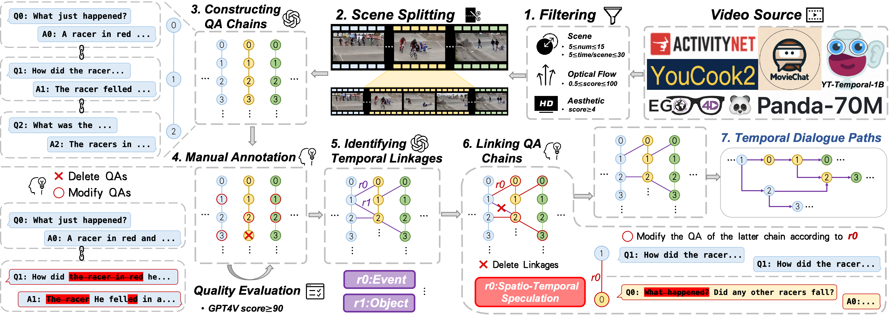
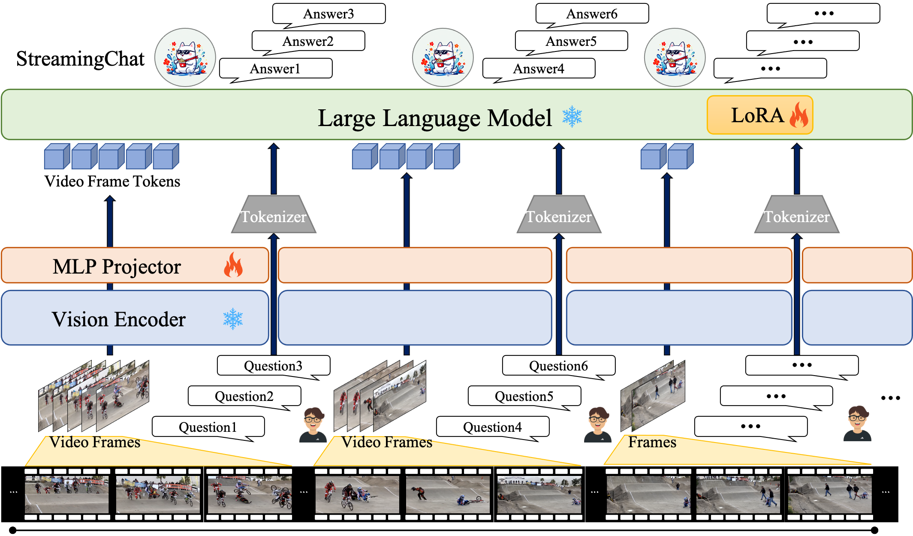

# **SVBench**

### **SVBench: A Benchmark with Temporal Multi-Turn Dialogues for Streaming Video Understanding**

This is the **code repository** of the paper "SVBench: A Benchmark with Temporal Multi-Turn Dialogues for Streaming Video Understanding".

## **Demo**
This is a data demo in our SVBench. The video is playing at 2x speed.

https://github.com/user-attachments/assets/310ec07d-64b0-4880-b383-d8522018b5ab

## **Overview**

Illustration of temporal multi-turn dialogues. A temporal dialogue path represents a conversation within a video progressing over time. Our SVBench evaluates the capabilities of LVLMs in long-context streaming video understanding by constructing temporal dialogue paths to assess 9 critical skills.



### **Abstract**

Despite the significant advancements of Large Vision-Language Models (LVLMs) on established benchmarks, there remains a notable gap in suitable evaluation regarding their applicability in the emerging domain of long-context streaming video understanding. Current benchmarks for video understanding typically emphasize isolated single-instance text inputs and fail to evaluate the capacity to sustain temporal reasoning throughout the entire duration of video streams. To address these limitations, we introduce SVBench, a pioneering benchmark with temporal multi-turn question-answering chains specifically designed to thoroughly assess the capabilities of streaming video understanding of current LVLMs. We design a semi-automated annotation pipeline to obtain 49,979 Question-Answer (QA) pairs of 1,353 streaming videos, which includes generating QA chains that represent a series of consecutive multi-turn dialogues over video segments and constructing temporal linkages between successive QA chains. Our experimental results, obtained from 14 models in dialogue and streaming evaluations, reveal that while the closed-source GPT-4o outperforms others, most open-source LVLMs struggle with long-context streaming video understanding. We also construct a StreamingChat model, which significantly outperforms open-source LVLMs on our SVBench and achieves comparable performance on diverse vision-language benchmarks. We expect SVBench to advance the research of streaming video understanding by providing a comprehensive and in-depth analysis of current LVLMs. Our benchmark and model can be accessed at https://anonymous.4open.science/r/SVBench-356F.

## **Getting Started**

### **Installation**

1. Clone the repository, click Download file
2. Install Python dependencies

```bash
conda create -n SVBench -y python=3.8.18
conda activate SVBench
conda install -y -c pytorch pytorch=1.11.0 torchvision=0.12.0
pip install opencv-python=4.10.0.84
pip install git+https://github.com/openai/CLIP.git
```

### **Data Preparation**

1. Directly download our filtered SVBench dataset (recommended):

(1) Download SVBench dataset from Hugging Face (We will open source it after the review process is completed):

```bash
git clone https://huggingface.co/XXX/SVBench
```

(2) Navigate to the dataset directory:

```bash
cd SVBench
```

(3) Concatenate the split files:

Use the cat command to concatenate all the split files into a single file. Assuming your split files are named from allVideos.part_aa to allVideos.part_ch, you can use the following command:

```bash
cat allVideos_tar_sep/allVideos.part_* > allVideo.tar.gz
```

(4) Verify the integrity of the file (optional):

Use the md5sum command to compute the checksum of the concatenated file and compare it with the provided checksum f5d08deb0d516c23caf8f1f6f0cda7d3:

```bash
md5sum allVideo.tar.gz
```

The output should look like this:

```bash
f5d08deb0d516c23caf8f1f6f0cda7d3  allVideo.tar.gz
```

If the checksum matches f5d08deb0d516c23caf8f1f6f0cda7d3, the file is intact and correct.

(5) Extract the concatenated file:

Use the tar command to extract the contents of allVideo.tar.gz:

```bash
tar -xzvf allVideo.tar.gz
```

After completing these steps, you should see the extracted video files in the current directory.


1. Download from the official website:

#### **YT-Temporal-1B**

Download the YT-Temporal-1B dataset following the instructions in the [**official web**](https://rowanzellers.com/merlotreserve/#data).

#### **YouCook2**

Download the YouCook2 dataset following the instructions in the [**official web**](http://youcook2.eecs.umich.edu/download).

#### **MovieChat** 

Download the MovieChat dataset following the instructions in the [**official web**](https://huggingface.co/datasets/Enxin/MovieChat-1K-test/tree/main).

#### **Panda-70M** 

Download the Panda-70M dataset following the instructions in the [**official web**](https://snap-research.github.io/Panda-70M/).

#### **Ego4D**

Download the ActivityNet dataset following the instructions in the [**official web**](https://ego4d-data.org/#download).

#### **ActivityNet** 

Download the ActivityNet dataset following the instructions in the [**official web**](http://activity-net.org/download.html).

## **SVBench**

This section provides instructions for reproducing the annotation and evaluation of SVBench.



### **1. Data Filtering**

Run the following commands to obtain filtered videos. 

Firstly, you should install [Open-Sora](https://github.com/hpcaitech/Open-Sora/tree/main/tools), and have a raw video dataset prepared. A meta file of the dataset information is needed for data processing. To create a meta file from a folder, run:

```bash
python -m Data_Filtering/Open-Sora-main/tools.datasets.convert video /path_to_your_video_folder --output /path_to_save_your_meta.csv
```

Then, run the following commands to get aesthetic scores and optical flow scores of your videos. Make sure the meta file has column 'path'.

```bash
torchrun --nproc_per_node 8 -m Data_Filtering/Open-Sora-main/tools.scoring.aesthetic.inference /path_to_save_your_meta_with_aesthetic_scores.csv --bs 1024 --num_workers 16
torchrun --standalone --nproc_per_node 8 Data_Filtering/Open-Sora-main/tools/scoring/optical_flow/inference.py /path_to_save_your_meta_with_optical_flow_scores.csv
```

With these information of videos above, you can filtering is conducted to retain only those videos containing 5 to 15 scenes,Then you can retain videos with an aesthetic score of 4 or above and with optical flow scores within the range of 0.5 to 100

### **2. Scene Detection and Video Splitting**

First you should have a meta file with column 'path' for the videos. Then run the following command:

```bash
python Data_Filtering/Open-Sora-main/tools.scene_cut.scene_detect.py ---output /path_to_meta.csv
```

The output is {prefix}_timestamp.csv with column timestamp. Each cell in column timestamp is a list of tuples, with each tuple indicating the start and end timestamp of a scene (e.g., [('00:00:01.234', '00:00:02.345'), ('00:00:03.456', '00:00:04.567')]).

### **3. Video Frame Extracting**

Video frame extraction can be directly run the following code. Run the following command:

```bash
python extract_video_frame/extract_video_frame_1s.py --data_dir allVideo --output_dir allVideo_frame
```

### **4. Constructing QA Chains for Video Dialogues**

Run the following command to construct QA chains for video dialogues.

'video_meta_with_timestamp' is the path of meta file of videos with video paths and timestamps.

'video_frame_folder' is the path of the folder saving all the video frames.

'output_folder' is the path of folder you want to save QA chains without right format.

```bash
python construct_data/construct_QA_chain.py --video_meta_with_timestamp /path_to_your_meta.csv --video_frame_folder /path_to_your_all_videos_frame_folder --output_folder /path_to_your_output_folder
```

Then run the following command to process the format of QA chains generated in first step.

'not_processed_QA_chain_folder' is the path of folder you save QA chains without right format.

'output_folder' is the path of folder you want to save QA chains with right format.

```bash
python construct_data/process_QA_chain_format --not_processed_QA_chain_folder /path_to_your_not_processed_QA_chain_folder --output_folder /path_to_your_output_folder
```

### **5. Implementing QA Quality Evaluation**

Run the following command:

```bash
python evaluation/eval_QA_quality.py
```

### **6. Identifying Temporal Linkages**

Run the following command to construct identify temporal linkages.

'QA_chains_folder' is the path of folder you want to save QA chains annotated with right format.

'output_folder' is the path of folder you want to save temporal linkages without right format.

```bash
python construct_data/identify_Temporal_Linkages.py --QA_chains_folder /path_to_your_QA_chains_folder --output_folder /path_to_your_output_folder
```

Then run the following command to process the format of temporal linkages generated in first step.

'not_processed_temporal_linkages_folder' is the path of folder you save temporal linkages without right format.

'output_folder' is the path of folder you want to save temporal linkages with right format.

```bash
python construct_data/process_temporal_linkages_format --not_processed_temporal_linkages_folder /path_to_your_not_processed_temporal_linkages_folder --output_folder /path_to_your_output_folder
```

### **7. Identifying Temporal Linkages**

1. ### **Evaluation**

Before running the script, please ensure you modify the following paths to match your local directory structure. This is crucial for the script to locate the necessary files and directories correctly. Below are the paths that need to be updated:

- answers_path: This should point to the directory where your answer files are stored.
- gt_dir: This should point to the directory containing your ground truth data.
- con_dir: This should point to the directory where your ConQA data is located.
- eval_SingleQA_result: This should be the path where you want to save the evaluation results for SingleQA.
- eval_chainQA_result: This should be the path where you want to save the evaluation results for ChainQA.
- eval_ConQA_result: This should be the path where you want to save the evaluation results for ConQA.

Example

```bash
answers_path = '/path/to/your/answers_path'
gt_dir = "/path/to/your/gt_dir"
con_dir = "/path/to/your/conQA_data_dir"
eval_SingleQA_result = '/path/to/your/save_file_for_SingleQA'
eval_chainQA_result = '/path/to/your/save_file_for_ChainQA'
eval_ConQA_result = '/path/to/your/save_file_for_ConQA'
```

#### **8.1.QA Evaluation**

Run the following command:

```bash
python evaluation/eval_SingleQA_gpt4_gpt4o.py
```

#### **8.2.Dialogue Evaluation**

Run the following command:

```bash
python evaluation/eval_chainQA_gpt4_gpt4o.py
```

#### **8.3.Streaming Evaluation**

Run the following command:

```bash
python evaluation/eval_ConQA_gpt4_gpt4o.py
```

## **Evaluation of StreamingChat**



1. ### **Data Preparation**

Data download reference：

https://internvl.readthedocs.io/en/latest/get_started/eval_data_preparation.html

1. ### **MMBench**

Run the following command:

```bash
GPUS=8 bash evaluate.sh work_dirs/internvl_chat_v2_0/internvl2_8b_internlm2_7b_dynamic_res_2nd_finetune_yzy_v6_merge mmbench-test-en --dynamic
```

Then, submit the results to the[ evaluation server](https://mmbench.opencompass.org.cn/mmbench-submission). The expected test results are: 

overall: 80.66

1. ### **CCBench**

Run the following command:

```bash
GPUS=8 bash evaluate.sh work_dirs/internvl_chat_v2_0/internvl2_8b_internlm2_7b_dynamic_res_2nd_finetune_yzy_v6_merge ccbench-dev --dynamic
```

Then, submit the results to the[ evaluation server](https://mmbench.opencompass.org.cn/mmbench-submission). The expected test results are: 

overall:74.71

1. ### **Tiny LVLM**

Run the following command:

```bash
GPUS=8 bash evaluate.sh work_dirs/internvl_chat_v2_0/internvl2_8b_internlm2_7b_dynamic_res_2nd_finetune_yzy_v6_merge tiny_lvlm --dynamic
```

The expected test results are:

```bash
Visual_Perception: 0.4825
ObjecCHallucination: 0.9033333333333333
Visual_Commonsense: 0.636
Visual_Knowledge_Acquisition: 0.6842857142857143
Visual_Reasoning: 0.6654545454545454
Overall: 3.371573593073593
```

1. ### **MM-Vet**

Run the following command:

```bash
GPUS=8 bash evaluate.sh work_dirs/internvl_chat_v2_0/internvl2_8b_internlm2_7b_dynamic_res_2nd_finetune_yzy_v6_merge mmvet --dynamic
```

Then, submit the results to the[ evaluation server](https://huggingface.co/spaces/whyu/MM-Vet_Evaluator). The expected test results are:

runs:36.9

1. ### **MMMU**

Run the following command:

```bash
GPUS=8 bash evaluate.sh work_dirs/internvl_chat_v2_0/internvl2_8b_internlm2_7b_dynamic_res_2nd_finetune_yzy_v6_merge mmmu-val --dynamic
```

The expected test results are:

```bash
{'Overall-Art and Design': {'num': 120, 'acc': 0.592}, 'Art': {'num': 30, 'acc': 0.733}, 'Art_Theory': {'num': 30, 'acc': 0.6},  'Overall': {'num': 900, 'acc': 0.49}}
```

1. ### **MMBench Video**

```bash
git clone https://github.com/open-compass/VLMEvalKit.git && cd VLMEvalKit && pip install -e .
```

You can place the required keys in $VLMEvalKit/.env or directly set them as the environment variable. If you choose to create a .env file, its content will look like:

```bash
# The .env file, place it under $VLMEvalKit
# API Keys of Proprietary VLMs
# QwenVL APIs
DASHSCOPE_API_KEY=
# Gemini w. Google Cloud Backends
GOOGLE_API_KEY=
# OpenAI API
OPENAI_API_KEY=
OPENAI_API_BASE=
# StepAI API
STEPAI_API_KEY=
# REKA API
REKA_API_KEY=
# GLMV API
GLMV_API_KEY=
# CongRong API
CW_API_BASE=
CW_API_KEY=
# SenseChat-V API
SENSECHAT_AK=
SENSECHAT_SK=
# Hunyuan-Vision API
HUNYUAN_SECRET_KEY=
HUNYUAN_SECRET_ID=
# You can also set a proxy for calling api models during the evaluation stage
EVAL_PROXY=
```

Fill the blanks with your API keys (if necessary). Those API keys will be automatically loaded when doing the inference and evaluation.

Run the following command:

```bash
torchrun --nproc-per-node=8 run.py --data MMBench-Video --model InternVL2-8B --verbose --nframe 8
```

The expected test results are:

```bash
 "coarse_all": {
        "CP": "1.53",
        "FP-S": "1.41",
        "FP-C": "1.16",
        "HL": "0.21",
        "LR": "1.06",
        "AR": "1.55",
        "RR": "1.59",
        "CSR": "1.37",
        "TR": "1.31",
        "Perception": "1.35",
        "Reasoning": "1.39",
        "Overall": "1.37"
    },
    "coarse_valid": {
        "CP": "1.53",
        "FP-S": "1.41",
        "FP-C": "1.16",
        "HL": "0.21",
        "LR": "1.06",
        "AR": "1.55",
        "RR": "1.59",
        "CSR": "1.37",
        "TR": "1.31",
        "Perception": "1.35",
        "Reasoning": "1.39",
        "Overall": "1.37"
    }
}
```
